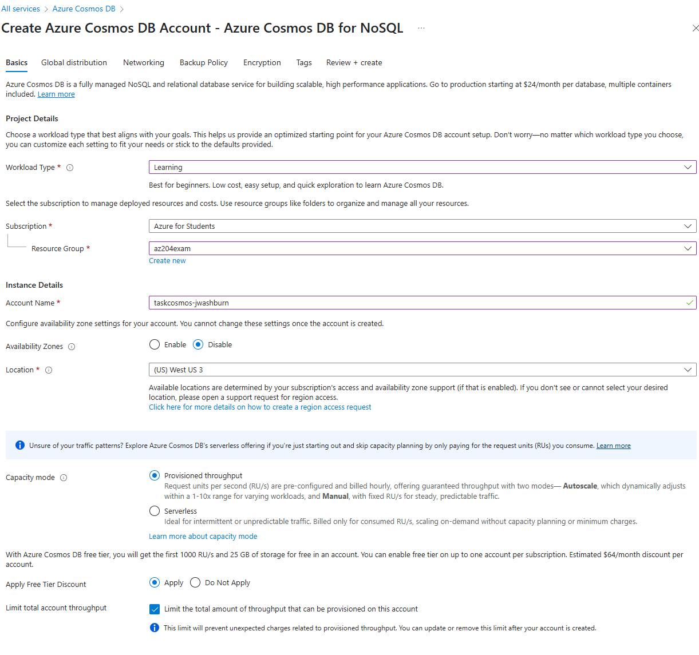
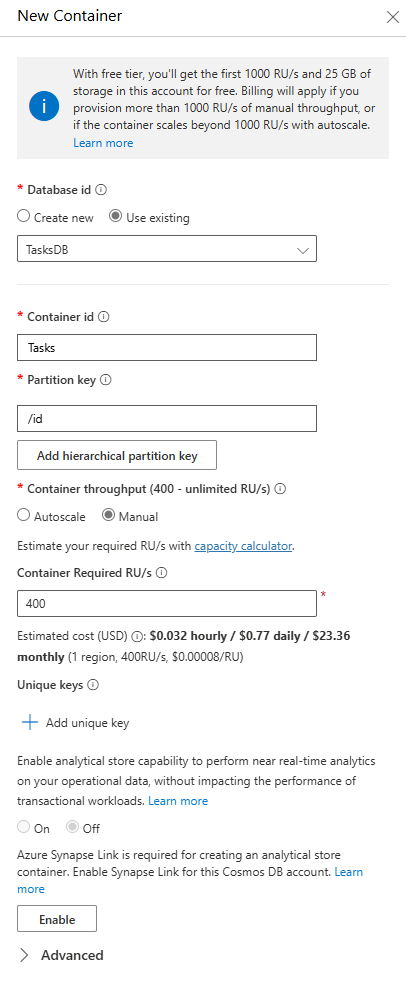
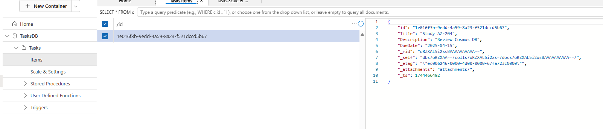
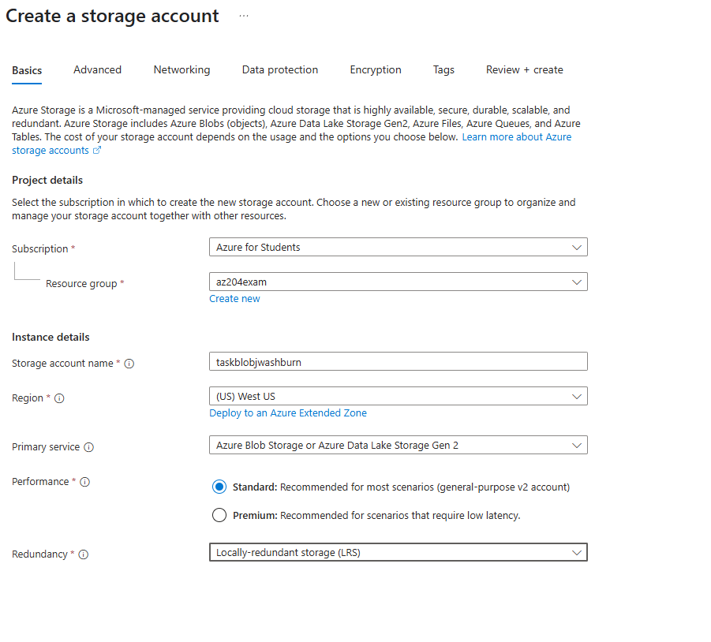

# Task Management Web App

A simple task management web application built with .NET, hosted on Azure App Service, using Azure Cosmos DB for storage, Azure Active Directory (AAD) for authentication, and Azure Monitor for insights. This project demonstrates key Azure services and concepts covered in the AZ-204 certification, including compute, storage, security, and monitoring.


## Architecture
- **Frontend**: .NET Core MVC (or React) hosted on Azure App Service.
- **Backend**: Azure Functions for serverless API endpoints handling CRUD operations.
- **Database**: Azure Cosmos DB (Core SQL API) for storing task data.
- **Storage**: Azure Blob Storage for task attachments (e.g., images).
- **Authentication**: Azure Active Directory for secure user login.
- **Monitoring**: Application Insights for performance telemetry.

## AZ-204 Topics Covered
- **Compute**: Azure App Service Web Apps, Azure Functions.
- **Storage**: Azure Cosmos DB, Azure Blob Storage.
- **Security**: Azure AD authentication, role-based access control (RBAC).
- **Monitoring**: Application Insights for telemetry and diagnostics.
- **Integration**: Consuming Azure services via SDKs.

## Prerequisites
- **.NET SDK 8.0** ([Install via winget](https://learn.microsoft.com/en-us/dotnet/core/install/windows?tabs=net80#install-with-windows-package-manager-winget): `winget install Microsoft.DotNet.SDK.8`)
- **Azure CLI** ([Install](https://learn.microsoft.com/en-us/cli/azure/install-azure-cli))
- **Azure Functions Core Tools** ([Install](https://github.com/Azure/azure-functions-core-tools/releases))
- **Azure Subscription** (Free tier or $200 credit recommended for minimal costs)


## Getting Started
Follow these steps to set up and deploy the app locally and on Azure (~2.5 hours total).

## Set Up Azure App Service

1. In the [Azure Portal](https://portal.azure.com), create a new App Service:
   - Use the **Free F1 tier** to avoid costs.
   - Note the app name (e.g., `taskmanagerweb-yourname`) and resource group (e.g., `az204exam`).
   - Check out the tabs for learning experience, we are leaving them default

   
2. Create a .NET Core MVC app locally:
   ```bash
   dotnet new mvc -o TaskManagerWeb
   cd TaskManagerWeb
   dotnet run
   ```
3. Verify the app runs at http://localhost:port
4. Launch your editor of choice:
   ```bash
   code.
   ```
5. Browse into the Models directory under TaskManagerWeb.
6. Add TaskItem.cs:
    ```csharp
        namespace TaskManagerWeb.Models
        {
            public class TaskItem
            {
                public string id { get; set; } = System.Guid.NewGuid().ToString();
                public string? Title { get; set; }
                public string? Description { get; set; }
                public string? DueDate { get; set; } // Changed to string
            }
        }
    ```
7. Update Controllers/HomeController.cs to handle tasks (in-memory for now):
    ```csharp
    using Microsoft.AspNetCore.Mvc;
    using TaskManagerWeb.Models;
    using System.Collections.Generic;

    namespace TaskManagerWeb.Controllers
    {
        public class HomeController : Controller
        {
            private static List<TaskItem> _tasks = new List<TaskItem>();

            public IActionResult Index()
            {
                return View(_tasks);
            }

            [HttpPost]
            public IActionResult Create(string title, string description, DateTime dueDate)
            {
                var task = new TaskItem
                {
                    Title = title,
                    Description = description,
                    DueDate = dueDate.ToString("yyyy-MM-dd") // Convert DateTime to string
                };
                _tasks.Add(task);
                return RedirectToAction("Index");
            }
        }
    }
    ```
### Modify the Home Page View to Add a Form (~5 min):
The view (Index.cshtml) defines the UI, including the form for adding tasks and a list to display them.
1. Open Views/Home/Index.cshtml.
Replace the default content with:
```html
@model List<TaskManagerWeb.Models.TaskItem>

<!DOCTYPE html>
<html lang="en">
<head>
    <meta charset="utf-8" />
    <meta name="viewport" content="width=device-width, initial-scale=1.0" />
    <title>Task Manager</title>
    <style>
        <text>
        body {
            font-family: 'Segoe UI', Arial, sans-serif;
            background-color: #f4f6f9;
            color: #333;
            margin: 0;
            padding: 20px;
            line-height: 1.6;
        }

        h1 {
            color: #2c3e50;
            text-align: center;
            margin-bottom: 20px;
        }

        h2 {
            color: #34495e;
            margin-top: 30px;
            border-bottom: 2px solid #3498db;
            padding-bottom: 5px;
        }

        form {
            background: #fff;
            padding: 20px;
            border-radius: 8px;
            box-shadow: 0 2px 10px rgba(0, 0, 0, 0.1);
            max-width: 500px;
            margin: 0 auto;
        }

        div {
            margin-bottom: 15px;
        }

        label {
            display: block;
            font-weight: 600;
            margin-bottom: 5px;
            color: #2c3e50;
        }

        input[type="text"],
        textarea,
        input[type="date"] {
            width: 100%;
            padding: 10px;
            border: 1px solid #ccc;
            border-radius: 4px;
            font-size: 14px;
            box-sizing: border-box;
        }

        textarea {
            resize: vertical;
            min-height: 100px;
        }

        input:focus,
        textarea:focus {
            outline: none;
            border-color: #3498db;
            box-shadow: 0 0 5px rgba(52, 152, 219, 0.3);
        }

        button {
            background-color: #3498db;
            color: #fff;
            padding: 10px 20px;
            border: none;
            border-radius: 4px;
            font-size: 16px;
            cursor: pointer;
            transition: background-color 0.3s;
        }

        button:hover {
            background-color: #2980b9;
        }

        ul {
            list-style: none;
            padding: 0;
            max-width: 600px;
            margin: 20px auto;
        }

        li {
            background: #fff;
            padding: 15px;
            margin-bottom: 10px;
            border-radius: 6px;
            box-shadow: 0 1px 5px rgba(0, 0, 0, 0.1);
            display: flex;
            justify-content: space-between;
            align-items: center;
        }

        li.no-tasks {
            color: #7f8c8d;
            font-style: italic;
            text-align: center;
            box-shadow: none;
        }

        .task-info {
            flex-grow: 1;
        }

        .task-info strong {
            color: #2c3e50;
        }

        @@media (max-width: 600px) {
            form, ul {
                padding: 10px;
            }

            li {
                flex-direction: column;
                align-items: flex-start;
            }
        }
        </text>
    </style>
</head>
<body>
    <h1>Task Manager</h1>

    <form asp-action="Create" method="post">
        <div>
            <label>Title:</label>
            <input type="text" name="title" required />
        </div>
        <div>
            <label>Description:</label>
            <textarea name="description"></textarea>
        </div>
        <div>
            <label>Due Date:</label>
            <input type="date" name="dueDate" required />
        </div>
        <button type="submit">Add Task</button>
    </form>

    <h2>Tasks</h2>
    <ul>
        @if (Model != null && Model.Any())
        {
            foreach (var task in Model)
            {
                <li>
                    <div class="task-info">
                        <strong>@task.Title</strong> - @task.Description
                        <br />
                        <small>Due: @(task.DueDate ?? "No due date")</small>
                    </div>
                </li>
            }
        }
        else
        {
            <li class="no-tasks">No tasks yet.</li>
        }
    </ul>
</body>
</html>
```
2.  Test the app works locally
```powershell
dotnet run
```

### Deploy to Azure App Service
1. Push the app you created up to the Azure App Service we previously made.
```bash
az webapp up --name taskmanagerweb-yourname --resource-group az204exam --sku F1 --location yourlocation
```
2. Test the app in your browser.  You should be able to get the URL from the App Service Overview page

### You have completed the Set Up Azure App Service section.
---
##	Create Azure Functions for APIs 
1. In the [Azure Portal](https://portal.azure.com), create a new Function App:
   - Check out the tabs for learning experience, we are leaving them default


   
2. From your root directory build your function
```bash
func init TaskManagerFunctions --dotnet
```
3. Move into the TaskManagerFunctions dir
```bash
cd TaskManagerFunctions
```
4. Build the function
```bash
func new --template "HttpTrigger" --name CreateTask
```

5. Test your function locally first
```bash
func start
```
You should see output like
```text
Functions:
    CreateTask: [GET,POST] http://localhost:7071/api/CreateTask
```
Open a browser and go to:
```text
http://localhost:7071/api/CreateTask?name=Test
```
Expected response should be something like this:
```text
This HTTP triggered function executed successfully. Pass a name in the query string or in the request body for a personalized response.
```
5. Deploy to Azure: 
```bash
func azure functionapp publish taskmanagerfunc-yourname #replace with your function name
```
Watch for the “Functions in taskmanagerfunc-yourname” section in the output. It should list:
```text
Functions in taskmanagerfunc-yourname:
    CreateTask - [httpTrigger]
        Invoke url: https://taskmanagerfunc-yourname.azurewebsites.net/api/createtask?code=...
```
6. Retrieve the Function Key
```bash
az functionapp function keys list --resource-group az204exam --name taskmanagerfunc-yourname --function-name CreateTask
```
7. Save the default key value.  We are going to use it in the next step.

8. Test it out:
- Construct the URL you need to test
- Take your invoke url from Step 5 and append your default key.  It should look something like this
```bash
https://taskmanagerfunc-jwashburn.azurewebsites.net/api/createtask?code=THISISYOURCODEFROMSTEP7&name=Test
```

- You should see something like:
```text
Hello, Test. This HTTP triggered function executed successfully.
```
### You have completed the Set Up Azure Functions for API section.
---

### Set Up Cosmos DB
1. In the Portal, go to “Azure Cosmos DB” > “Create.  Choose NoSQL API”
2. Choose your settings.  You can refer to the sceenshot for details.  Again flip through the tabs to see what is there, but leave defaults



## Create Database and Container
- In the Cosmos DB account, go to “Data Explorer.”
- New Database: TasksDB.
- New Container: Use Existing > Choose TasksDB Tasks, Partition Key: /id, Throughput: 400 RU/s



## Get Connection Strings:
- Go to Settings> Keys copy the Primary Connection String.  Save them we are going to need them in a minute.

### You have completed the Set Up Cosmos DBsection.
---

## Update the Function to Use Cosmos DB
- Modify the CreateTask Function to save tasks to Cosmos DB.

### Add the Cosmos DB SDK:
1. In the TaskManagerFunctions directory
```powershell
cd TaskManagerFunctions
dotnet add package Microsoft.Azure.Cosmos
dotnet add package Microsoft.Azure.WebJobs.Extensions.CosmosDB
```
2. Update CreateTask.cs
- Replace the existing code with:
```csharp
using System.Threading.Tasks;
using Microsoft.AspNetCore.Mvc;
using Microsoft.Azure.WebJobs;
using Microsoft.Azure.WebJobs.Extensions.Http;
using Microsoft.AspNetCore.Http;
using Microsoft.Extensions.Logging;
using Microsoft.Azure.Cosmos;
using System.Text.Json;
using System.IO; // Added this line

namespace TaskManagerFunctions
{
    public class TaskItem
    {
        public string id { get; set; } = System.Guid.NewGuid().ToString();
        public string Title { get; set; }
        public string Description { get; set; }
        public string DueDate { get; set; }
    }

    public static class CreateTask
    {
        [FunctionName("CreateTask")]
        public static async Task<IActionResult> Run(
            [HttpTrigger(AuthorizationLevel.Function, "post", Route = null)] HttpRequest req,
            [CosmosDB(databaseName: "TasksDB", containerName: "Tasks", Connection = "CosmosDBConnection")] CosmosClient cosmosClient,
            ILogger log)
        {
            log.LogInformation("C# HTTP trigger function processed a request.");

            string requestBody = await new StreamReader(req.Body).ReadToEndAsync();
            var task = JsonSerializer.Deserialize<TaskItem>(requestBody);

            if (task == null || string.IsNullOrEmpty(task.Title) || string.IsNullOrEmpty(task.DueDate))
            {
                return new BadRequestObjectResult("Please provide a valid task with Title and DueDate.");
            }

            var container = cosmosClient.GetContainer("TasksDB", "Tasks");
            await container.CreateItemAsync(task);

            return new OkObjectResult("Task created successfully.");
        }
    }
}
```


### Add the Connection String to the Function App:
1. In the Portal, Go to your Function App. Settings > Environment Variables
2. Click Add
- Name: CosmosDBConnection.
- Value: Paste the PRIMARY CONNECTION STRING from Cosmos DB.
- Click Apply twice and confirm to make sure its saved.

### Redeploy the FunctionApp
```powershell
func azure functionapp publish taskmanagerfunc-yourname
```

### Send a Test
You could use POSTMAN or a CURL Command
Use the key from before.  If you need help getting that again run
```powershell
az functionapp function keys list --resource-group az204exam --name taskmanagerfunc-yourname --function-name CreateTask
```
Feel free to send any message that makes sense to you
```bash
curl -X POST -H "Content-Type: application/json" -d '{"Title":"Study AZ-204","Description":"Review Cosmos DB","DueDate":"2025-04-15"}' "https://taskmanagerfunc-jwashburn.azurewebsites.net/api/createtask?code=YOURCODEFROMBEFORE=="
```

Go into the Azure Portal > CosmosDB and drill down using Data Explorer and find your item


### You have completed the Add the Connection String to the Function App Section.
---

## Update the HomeController with the Function App changes.
Now we need to add some more settings to Environment Variables and update HomeController.cs This section updates the HomeController.cs file in the TaskManagerWeb project to integrate the web app’s frontend with the Azure Function created earlier, enabling tasks to be saved to Azure Cosmos DB.

Go to the Azure Portal and go to your Web App.  Service > Setting > Environment Variables

Add 2 settings

- Name: FunctionSettings__CreateTaskUrl
- Value: https://taskmanagerfunc-yourname.azurewebsites.net/api/createtask

- Name: FunctionSettings__FunctionKey
- Value: USE_YOUR_KEY_HERE


Replace all the code in TaskManagerWeb/Controllers/HomeController.cs with this code
```csharp
using Microsoft.AspNetCore.Mvc;
using TaskManagerWeb.Models;
using System.Collections.Generic;
using System.Net.Http;
using System.Text;
using System.Text.Json;
using System.Threading.Tasks;

namespace TaskManagerWeb.Controllers
{
    public class HomeController : Controller
    {
        private static List<TaskItem> _tasks = new List<TaskItem>(); // Temporary in-memory storage
        private readonly HttpClient _httpClient;
        private readonly string _functionUrl;

        public HomeController(IHttpClientFactory httpClientFactory, IConfiguration configuration)
        {
            _httpClient = httpClientFactory.CreateClient();
            var baseUrl = configuration["FunctionSettings:CreateTaskUrl"];
            var functionKey = configuration["FunctionSettings:FunctionKey"];
            _functionUrl = $"{baseUrl}?code={functionKey}";
        }

        public IActionResult Index()
        {
            return View(_tasks);
        }

        [HttpPost]
        public async Task<IActionResult> Create(string title, string description, string dueDate)
        {
            var task = new TaskItem
            {
                Title = title,
                Description = description,
                DueDate = dueDate
            };

            var content = new StringContent(JsonSerializer.Serialize(task), Encoding.UTF8, "application/json");
            var response = await _httpClient.PostAsync(_functionUrl, content);

            if (response.IsSuccessStatusCode)
            {
                _tasks.Add(task); // Still using in-memory for display; later replace with Cosmos DB read
                return RedirectToAction("Index");
            }

            ModelState.AddModelError("", "Failed to create task.");
            return View("Index", _tasks);
        }
    }
}
```


Rebuild the app to get the changes into the code.

Make sure you are in your TaskManagerWeb directory
```powershell
dotnet build
```

Push the changes up to Azure
```powershell
az webapp up --name taskmanagerweb-jwashburn --resource-group az204exam --sku F1 --location westus
```

### You have completed the Update the HomeController with the Function App changes Section.
---

## Add Blob Storage
In the Azure Portal Create a new Storage account

Look through the tabs for learning, but leave as default.



### Add a Container
- Data_Storage> Containers.  Add a Container
- Name: attachments.
- Go to Access Keys and copy the Connection String for Key1

### Add the keys to your Function App
- Settings > Environment Variables
- Add a new application setting:
- Name: BlobStorageConnectionString.
- Value: Paste the Blob Storage connection string from the previous step

### You have completed the Add Blob Storage Section.
---

## Update the CreateTask Function to Handle File Uploads
In the TaskManagerFunctions directory, add the Blob Storage SDK

```powershell
dotnet add package Azure.Storage.Blobs
dotnet add package Microsoft.Azure.WebJobs.Extensions.Storage
```

Update CreateTask.cs to handle a file upload and store it in Blob Storage:
```csharp
using System.Threading.Tasks;
using Microsoft.AspNetCore.Mvc;
using Microsoft.Azure.WebJobs;
using Microsoft.Azure.WebJobs.Extensions.Http;
using Microsoft.AspNetCore.Http;
using Microsoft.Extensions.Logging;
using Microsoft.Azure.Cosmos;
using System.Text.Json;
using System.IO;
using Azure.Storage.Blobs;

namespace TaskManagerFunctions
{
    public class TaskItem
    {
        public string id { get; set; } = System.Guid.NewGuid().ToString();
        public string Title { get; set; }
        public string Description { get; set; }
        public string DueDate { get; set; }
        public string AttachmentUrl { get; set; } // Add this to store the Blob URL
    }

    public static class CreateTask
    {
        [FunctionName("CreateTask")]
        public static async Task<IActionResult> Run(
            [HttpTrigger(AuthorizationLevel.Function, "post", Route = null)] HttpRequest req,
            [CosmosDB(databaseName: "TasksDB", containerName: "Tasks", Connection = "CosmosDBConnection")] CosmosClient cosmosClient,
            [Blob("attachments", Connection = "BlobStorageConnectionString")] BlobContainerClient blobContainerClient,
            ILogger log)
        {
            log.LogInformation("C# HTTP trigger function processed a request.");

            if (!req.HasFormContentType)
            {
                return new BadRequestObjectResult("Please send a multipart form request.");
            }

            var form = await req.ReadFormAsync();
            var title = form["title"];
            var description = form["description"];
            var dueDate = form["dueDate"];

            if (string.IsNullOrEmpty(title) || string.IsNullOrEmpty(dueDate))
            {
                return new BadRequestObjectResult("Please provide a valid task with Title and DueDate.");
            }

            var task = new TaskItem
            {
                Title = title,
                Description = description,
                DueDate = dueDate
            };

            // Handle file upload
            var files = form.Files;
            if (files.Count > 0)
            {
                var file = files[0];
                if (file.Length > 0)
                {
                    var blobName = $"{task.id}/{file.FileName}";
                    var blobClient = blobContainerClient.GetBlobClient(blobName);
                    using (var stream = file.OpenReadStream())
                    {
                        await blobClient.UploadAsync(stream, overwrite: true);
                    }
                    task.AttachmentUrl = blobClient.Uri.ToString();
                }
            }

            var container = cosmosClient.GetContainer("TasksDB", "Tasks");
            await container.CreateItemAsync(task);

            return new OkObjectResult("Task created successfully.");
        }
    }
}
```

### Redeploy the Function
Deploy the updated Function:

```powershell
func azure functionapp publish taskmanagerfunc-jwashburn
```

### You have completed the CreateTask Function to Handle File Uploads Section.
---

### Update files to support File Uploads:

#### Update the Web App Form to Include File Upload
- Open TaskManagerWeb/Views/Home/Index.cshtml and change your code to this

```csharp
@model List<TaskManagerWeb.Models.TaskItem>

<!DOCTYPE html>
<html lang="en">
<head>
    <meta charset="utf-8" />
    <meta name="viewport" content="width=device-width, initial-scale=1.0" />
    <title>Task Manager</title>
    <style>
        <text>
        body {
            font-family: 'Segoe UI', Arial, sans-serif;
            background-color: #f4f6f9;
            color: #333;
            margin: 0;
            padding: 20px;
            line-height: 1.6;
        }

        h1 {
            color: #2c3e50;
            text-align: center;
            margin-bottom: 20px;
        }

        h2 {
            color: #34495e;
            margin-top: 30px;
            border-bottom: 2px solid #3498db;
            padding-bottom: 5px;
        }

        form {
            background: #fff;
            padding: 20px;
            border-radius: 8px;
            box-shadow: 0 2px 10px rgba(0, 0, 0, 0.1);
            max-width: 500px;
            margin: 0 auto;
        }

        div {
            margin-bottom: 15px;
        }

        label {
            display: block;
            font-weight: 600;
            margin-bottom: 5px;
            color: #2c3e50;
        }

        input[type="text"],
        textarea,
        input[type="date"],
        input[type="file"] {
            width: 100%;
            padding: 10px;
            border: 1px solid #ccc;
            border-radius: 4px;
            font-size: 14px;
            box-sizing: border-box;
        }

        textarea {
            resize: vertical;
            min-height: 100px;
        }

        input:focus,
        textarea:focus,
        input[type="file"]:focus {
            outline: none;
            border-color: #3498db;
            box-shadow: 0 0 5px rgba(52, 152, 219, 0.3);
        }

        button {
            background-color: #3498db;
            color: #fff;
            padding: 10px 20px;
            border: none;
            border-radius: 4px;
            font-size: 16px;
            cursor: pointer;
            transition: background-color 0.3s;
        }

        button:hover {
            background-color: #2980b9;
        }

        ul {
            list-style: none;
            padding: 0;
            max-width: 600px;
            margin: 20px auto;
        }

        li {
            background: #fff;
            padding: 15px;
            margin-bottom: 10px;
            border-radius: 6px;
            box-shadow: 0 1px 5px rgba(0, 0, 0, 0.1);
            display: flex;
            justify-content: space-between;
            align-items: center;
        }

        li.no-tasks {
            color: #7f8c8d;
            font-style: italic;
            text-align: center;
            box-shadow: none;
        }

        .task-info {
            flex-grow: 1;
        }

        .task-info strong {
            color: #2c3e50;
        }

        a {
            color: #3498db;
            text-decoration: none;
            margin-left: 10px;
        }

        a:hover {
            text-decoration: underline;
        }

        @@media (max-width: 600px) {
            form, ul {
                padding: 10px;
            }

            li {
                flex-direction: column;
                align-items: flex-start;
            }
        }
        </text>
    </style>
</head>
<body>
    <h1>Task Manager</h1>

    <form asp-action="Create" method="post" enctype="multipart/form-data">
        <div>
            <label>Title:</label>
            <input type="text" name="title" required />
        </div>
        <div>
            <label>Description:</label>
            <textarea name="description"></textarea>
        </div>
        <div>
            <label>Due Date:</label>
            <input type="date" name="dueDate" required />
        </div>
        <div>
            <label>Attachment:</label>
            <input type="file" name="attachment" />
        </div>
        <button type="submit">Add Task</button>
    </form>

    <h2>Tasks</h2>
    <ul>
        @if (Model != null && Model.Any())
        {
            foreach (var task in Model)
            {
                <li>
                    <div class="task-info">
                        <strong>@task.Title</strong> - @task.Description
                        <br />
                        <small>Due: @(task.DueDate ?? "No due date")</small>
                        @if (!string.IsNullOrEmpty(task.AttachmentUrl))
                        {
                            <br />
                            <a href="@task.AttachmentUrl" target="_blank">View Attachment</a>
                        }
                    </div>
                </li>
            }
        }
        else
        {
            <li class="no-tasks">No tasks yet.</li>
        }
    </ul>
</body>
</html>
```
#### Update HomeController.cs to Handle File Upload:
- Update TaskMangerWeb/Controllers/HomeController.cs to send the form data (including the file) to the Function with these code changes:
```csharp
using Microsoft.AspNetCore.Mvc;
using TaskManagerWeb.Models;
using System.Collections.Generic;
using System.Net.Http;
using System.Threading.Tasks;

namespace TaskManagerWeb.Controllers
{
    public class HomeController : Controller
    {
        private static List<TaskItem> _tasks = new List<TaskItem>(); // Temporary in-memory storage
        private readonly HttpClient _httpClient;
        private readonly string _functionUrl;

        public HomeController(IHttpClientFactory httpClientFactory, IConfiguration configuration)
        {
            _httpClient = httpClientFactory.CreateClient();
            var baseUrl = configuration["FunctionSettings:CreateTaskUrl"];
            var functionKey = configuration["FunctionSettings:FunctionKey"];
            _functionUrl = $"{baseUrl}?code={functionKey}";
        }

        public IActionResult Index()
        {
            return View(_tasks);
        }

        [HttpPost]
        public async Task<IActionResult> Create(string title, string description, string dueDate, IFormFile attachment)
        {
            var formData = new MultipartFormDataContent();
            formData.Add(new StringContent(title ?? ""), "title");
            formData.Add(new StringContent(description ?? ""), "description");
            formData.Add(new StringContent(dueDate ?? ""), "dueDate");

            if (attachment != null && attachment.Length > 0)
            {
                var fileContent = new StreamContent(attachment.OpenReadStream());
                fileContent.Headers.ContentType = new System.Net.Http.Headers.MediaTypeHeaderValue(attachment.ContentType);
                formData.Add(fileContent, "attachment", attachment.FileName);
            }

            var response = await _httpClient.PostAsync(_functionUrl, formData);

            if (response.IsSuccessStatusCode)
            {
                var task = new TaskItem
                {
                    Title = title,
                    Description = description,
                    DueDate = dueDate
                };
                _tasks.Add(task); // Still using in-memory for display; later replace with Cosmos DB read
                return RedirectToAction("Index");
            }

            ModelState.AddModelError("", "Failed to create task.");
            return View("Index", _tasks);
        }
    }
}
```

#### Update TaskItem.cs to Include AttachmentUrl:
- Open TaskManagerWeb/Models/TaskItem.cs and make these changes:
```csharp
namespace TaskManagerWeb.Models
{
    public class TaskItem
    {
        public string id { get; set; } = System.Guid.NewGuid().ToString();
        public string? Title { get; set; }
        public string? Description { get; set; }
        public string? DueDate { get; set; }
        public string? AttachmentUrl { get; set; } // Add this
    }
}
```


- Adjust TaskManagerWeb/Program.cs to include the AddHttpClient

```csharp
using Microsoft.AspNetCore.Builder;
using Microsoft.Extensions.DependencyInjection;
using Microsoft.Extensions.Hosting;

var builder = WebApplication.CreateBuilder(args);

// Add services to the container
builder.Services.AddControllersWithViews();
builder.Services.AddHttpClient(); // Register IHttpClientFactory

var app = builder.Build();

// Configure the HTTP request pipeline
if (!app.Environment.IsDevelopment())
{
    app.UseExceptionHandler("/Home/Error");
    app.UseHsts();
}

app.UseHttpsRedirection();
app.UseStaticFiles();
app.UseRouting();
app.UseAuthorization();

app.MapControllerRoute(
    name: "default",
    pattern: "{controller=Home}/{action=Index}/{id?}");

app.Run();
```

- Change back to the TaskManagerWeb Directory and push up the change

```powershell
az webapp up --name taskmanagerweb-jwashburn --resource-group az204exam --sku F1 --location westus
```

BROKEN HERE

Uploads seem to fail silently

## Application Insights
At this point you are likely hitting app errors and other problems as this code is AI generated and not tested at any real level of scrutiny.  So lets get App Insights going to help troubleshoot the problem


## Go Test in Azure

STILL to DO
AD Auth


# Cost Estimate
- **App Service:**  Free (F1 tier).
- **Azure Functions:** ~$0.05–$0.10 (Consumption plan, light usage).
- **Cosmos DB: Free** (1000 RU/s tier).
- **Blob Storage:** ~$0.05–$0.10 (minimal storage/transactions).
- **Azure AD/Application Insights:** Free.
## Total: ~$0.10–$0.25 for initial setup and testing, well within $200 credit.

# Learning Outcomes
- Deploy and configure Azure App Service and Functions.
- Work with Cosmos DB for NoSQL data and Blob Storage for files.
- Implement authentication and RBAC.
- Monitor apps with Application Insights
